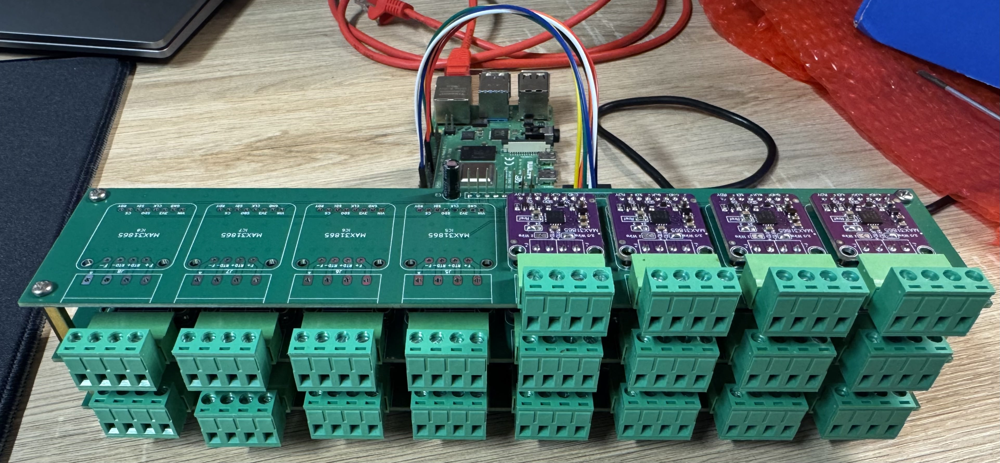
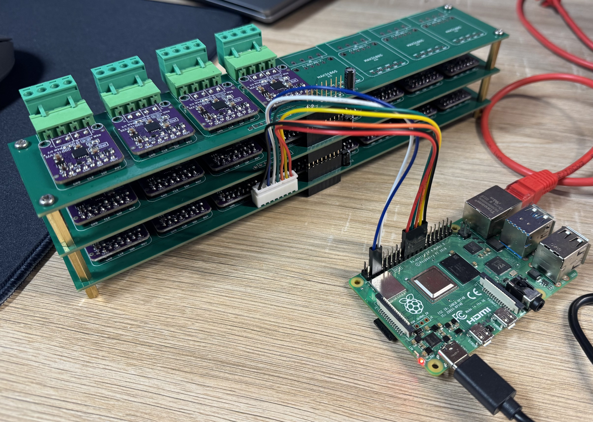
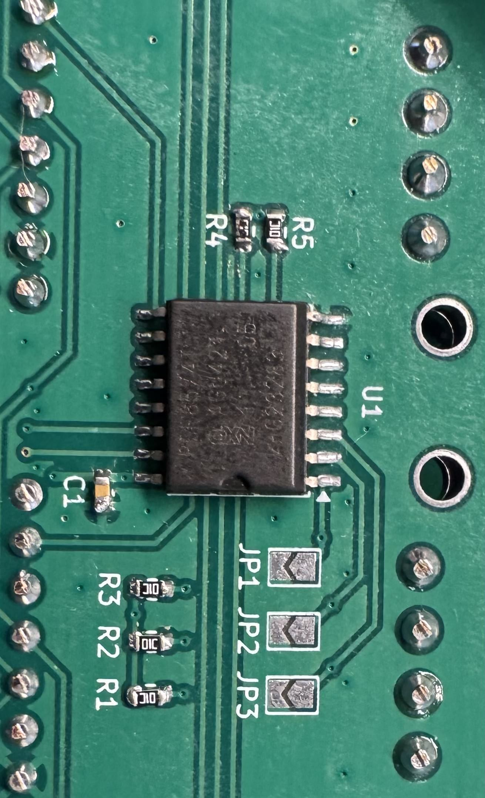
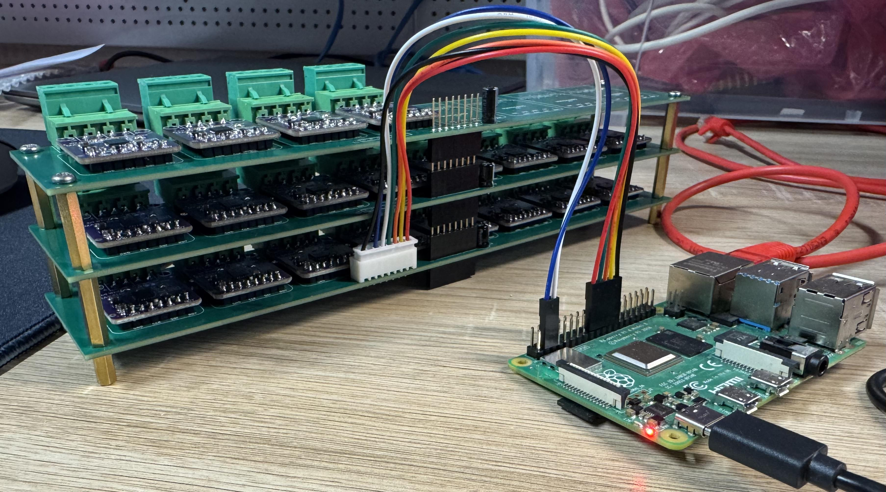

# MAX31865 Stack

A stackable carrier board for the **Adafruit MAX31865** RTD-to-digital
converter. Each board hosts up to **8 MAX31865 modules** and multiple boards
can be stacked on brass standoffs to scale the channel count without changing
the wiring to the host.

<p align="center">
  
</p>

## Overview

Each MAX31865 from Adafruit is an excellent PT100/PT1000 front-end, but
wiring more than a handful of them by hand is tedious and error-prone — every
module needs power, an SPI bus and its own chip-select line.

This project solves that with a carrier PCB that:

- mounts up to **8 plug-in MAX31865 modules** per board,
- brings out a **4-pin pluggable terminal block** per channel for the RTD
  sensor (2/3/4-wire compatible),
- shares one SPI bus across all modules,
- generates individual chip-select signals from a single **PCF8574 I2C
  expander**, so only a handful of signals (SDA, SCL, MOSI, MISO, SCK plus
  3.3 V/GND) ever leave the stack regardless of how many boards are stacked,
- **stacks vertically** on brass M3 standoffs through stackable pin headers
  that pass the bus straight through, so the wiring from the Raspberry Pi
  goes to a single **8-pin JST XH** connector on the bottom board and every
  board above it is simply plugged into the one below.

With the default I2C address range (0x20–0x27) the stack supports
**up to 8 boards = 64 RTD channels** from a single Raspberry Pi.

<p align="center">
  
</p>

## Features

- Up to **8 channels per board**, scalable to **64 channels** per stack.
- Pluggable green terminal blocks for each sensor — sensors can be swapped
  without unsoldering or disturbing the stack.
- **2-, 3- and 4-wire RTD** wiring supported (selected per-module on the
  Adafruit board itself).
- Works with both **PT100** and **PT1000** modules; selectable in software.
- Connects to the host with a single **8-pin JST XH** cable on the bottom
  board; the rest of the stack is bussed through stackable pin headers.
- KiCad sources and JLCPCB production files included.
- Reference Python driver included that auto-detects expanders and modules,
  reads all channels in continuous mode and prints fault-decoded
  measurements.

## Hardware

### Block diagram

```
                              JST XH 8-pin
                                   │
                                   ▼
  Raspberry Pi ──── Board #1 (bottom) ──┐
                    Board #2            │  stacked through
                    Board #N            │  pass-through pin headers
                    ──────────────────  ┘  (I2C + SPI + power)
                         │
        ┌────────────────┼────────────────┐
        ▼                ▼                ▼
     PCF8574          PCF8574          PCF8574
      0x25             0x26             0x27
        │                │                │
        ▼                ▼                ▼
     8x CS            8x CS            8x CS
        │                │                │
        ▼                ▼                ▼
    8x MAX31865      8x MAX31865      8x MAX31865

  SPI bus (SCK, MOSI, MISO) is shared across every MAX31865 on every board.
  CS for each module is driven by one PCF8574 output.
```

The PCF8574 expander on each board takes the I2C address selected by the
jumpers `JP1` / `JP2` / `JP3` (PCF8574 address bits A0/A1/A2). This is how
each board in the stack gets its own unique address — and therefore its own
set of 8 chip-select lines.

<p align="center">
  
</p>

### Per-board contents

| Reference | Part |
|-----------|------|
| U1        | PCF8574 I2C 8-bit I/O expander (SOIC-16) |
| 8x        | Sockets for Adafruit MAX31865 PT100/PT1000 breakout |
| 8x        | 4-pin pluggable terminal blocks (5.08 mm, RTD sensor) |
| JP1–JP3   | I2C address jumpers (A0, A1, A2) |
| J1        | 8-pin JST XH connector (host link, populated on bottom board only) |
| —         | 8-pin stackable pin headers — bus pass-through between boards |

### Stacking

Boards stack mechanically on **brass M3 standoffs** and electrically through
**stackable 8-pin pin headers**, which pass the I2C, SPI and power signals
straight up through the stack.

The bottom board carries the **8-pin JST XH connector (J1)** that is wired
to the Raspberry Pi. Any boards above it inherit the same bus through the
pass-through headers — no extra cabling is needed when adding a board.

Each board only needs a unique PCF8574 address, set with the three address
jumpers (`JP1`/`JP2`/`JP3`).

<p align="center">
  
</p>

### Sensor wiring

Each channel exposes a 4-pin pluggable terminal block matching the Adafruit
MAX31865 module pinout. Use the Adafruit module's own solder jumpers to
configure 2-, 3- or 4-wire mode.

> ⚠️ Use a **reference resistor matched to your RTD**:
> - PT100  → 430 Ω  (default on Adafruit boards)
> - PT1000 → 4300 Ω
>
> Mixing PT1000 sensors with the default 430 Ω reference (or vice versa)
> will not work correctly.

## Software

A reference reader is provided in [`software/read.py`](software/read.py).
It runs on Linux (tested on Raspberry Pi OS) and:

1. Scans I2C addresses 0x20–0x27 for PCF8574 expanders.
2. For every CS pin on every expander, probes for a MAX31865 by writing and
   reading back the CONFIG and threshold registers.
3. Starts continuous conversion on every detected module.
4. Periodically reads all channels, decodes any fault bits, converts the raw
   ADC value to resistance and then to temperature using the
   **Callendar–Van Dusen** equation (closed-form for t ≥ 0 °C, bisection of
   the full 4-coefficient form for t < 0 °C).

### Requirements

- Raspberry Pi (or another Linux SBC) with I2C and SPI enabled
- Python 3.7+
- Python packages listed in [`software/requirements.txt`](software/requirements.txt):
  ```bash
  pip install -r software/requirements.txt
  ```

### Enabling I2C and SPI on Raspberry Pi

Both buses are disabled by default on a fresh Raspberry Pi OS image. Enable
them with `raspi-config`:

```bash
sudo raspi-config
```

Then navigate to **Interface Options → I2C → Enable** and
**Interface Options → SPI → Enable**, and reboot.

After the reboot you should see the devices in `/dev`:

```bash
ls /dev/i2c-* /dev/spidev*
# /dev/i2c-1  /dev/spidev0.0  /dev/spidev0.1
```

A quick sanity check that the boards are visible on the I2C bus:

```bash
sudo apt install i2c-tools
i2cdetect -y 1
```

You should see the PCF8574 expanders show up in the 0x20–0x27 range — one
address per board in the stack.

### Configuration

Open [`software/read.py`](software/read.py) and adjust the constants at the
top of the file:

| Constant            | Meaning                                                      |
|---------------------|--------------------------------------------------------------|
| `I2C_BUS`           | I2C bus index (`1` on Raspberry Pi)                          |
| `SPI_BUS`/`SPI_DEVICE` | SPI bus/CS index used to talk to the modules              |
| `SPI_SPEED_HZ`      | SPI clock; 100 kHz is conservative and reliable              |
| `THREE_WIRE`        | `True` for 3-wire RTDs, `False` for 2/4-wire                 |
| `FILTER_50HZ`       | `True` in 50 Hz mains regions, `False` for 60 Hz             |
| `RNOMINAL`          | `100.0` for PT100, `1000.0` for PT1000                       |
| `DEFAULT_RREF`      | Reference resistor on the Adafruit module (430 / 4300 Ω)     |
| `PRINT_INTERVAL`    | Seconds between measurement scans                            |

### Running

```bash
python3 software/read.py
```

Example output:

```
MAX31865 multi-board reader
==========================
I2C bus:       1
SPI bus/dev:   0.0
...

Scanning for PCF8574 expanders...
  expander found: 0x25
  expander found: 0x26
  expander found: 0x27

Detecting MAX31865 modules behind each CS pin...
Expander 0x25:
  P0: MAX31865 OK      CONFIG OK 0x91, marker OK
  ...

============================================================
2026-05-15 14:23:01
CH00 E0x25-P0: OK        23.451 C   R=109.123 Ohm   raw=8412
CH01 E0x25-P1: OK        23.802 C   R=109.260 Ohm   raw=8423
...
scan time: 142.318 ms   OK=24   NOT_OK=0
```

## Repository layout

```
.
├── assets/         photos of the assembled stack
├── hardware/       KiCad project (schematic, PCB) + JLCPCB production files
├── software/       Python reader for Raspberry Pi
├── LICENSE         MIT
└── README.md       you are here
```

## License

Released under the [MIT License](LICENSE). The Adafruit MAX31865 module is a
separate product; consult Adafruit's own documentation and licensing for the
module itself.

## Author

Martin Lysek — 2026.
